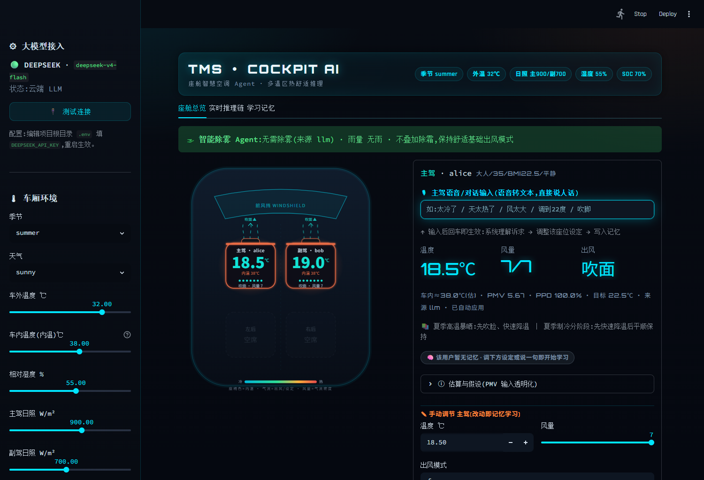
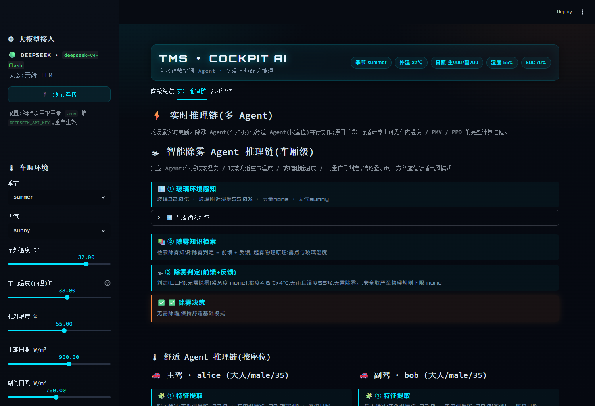
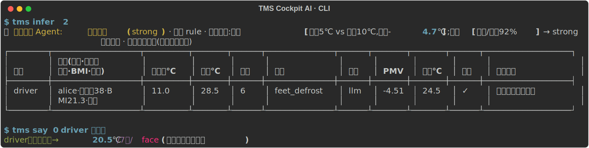
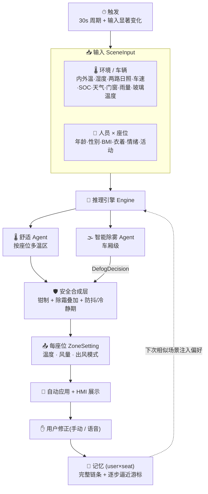
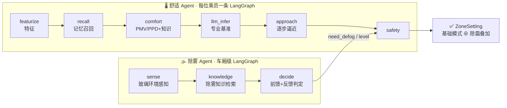
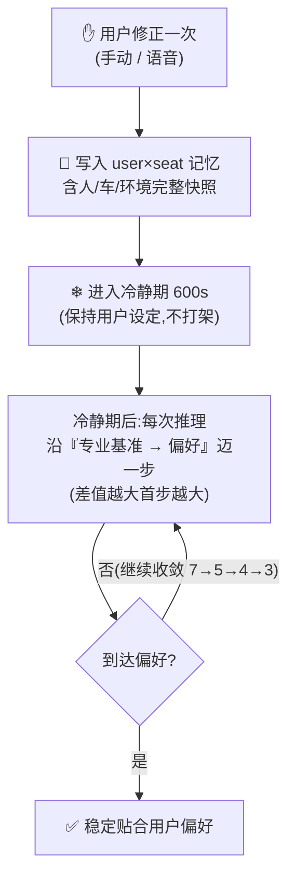

# 🚗❄️ 座舱智慧空调 Agent · TMS Cockpit AI

> 基于 **LangGraph + LangChain** 的多 Agent 座舱热舒适系统。输入环境 / 人员 / 车辆 / 天气,
> 经 **ISO 7730 / ASHRAE 55 专业知识约束的 LLM** 推理,为**每位乘员独立**给出
> **温度 / 风量 / 出风模式**;用户手动或语音修改被**记忆并逐步逼近**,越用越懂你。


---

## 🧭 这是什么

一套面向汽车座舱的「**热感知 → 专业推理 → 多温区下发 → 学习用户偏好**」闭环智能体。
核心价值不是"调一次空调",而是 **记忆闭环 + 专业知识约束 + 多 Agent 协作**:

- 不靠通用大模型拍脑袋——用 **PMV/PPD 计算工具 + 知识库 RAG** 给 LLM 立"专业规矩";
- **每位乘员独立预测**(多温区),按 `用户 × 座位` 独立记忆;
- 把**智能除雾**拆成**独立 Agent**,与舒适推理解耦、安全优先叠加;
- 用户每次手动/语音修改都被**完整记录并逐步逼近**,下次相似场景自动贴合。

本期为 PC / Python PoC,模块化、为产品化(真实 CAN 信号、域控部署)预留接口。

---

## 🖼️ 界面预览

**座舱总览**:车厢俯视 HUD(座椅按**车内温度**着色、按出风模式喷射**动态气流**)+ 独立除雾 Agent 决策横幅 + 每座位推荐与手动调节。



**实时推理链(多 Agent)**:车厢级**除雾 Agent**(感知→检索→判定)与按座位**舒适 Agent** 并行展示,全过程可解释。



**CLI 终端**:与 Web **同一套引擎、功能对齐**——`infer` 含除雾 Agent 决策与推荐表、`say` 语音指令、`chain` 多 Agent 推理链、`memory` 记忆链条。双击 `run_cli.bat` 一键进入。



---

## ✨ 核心能力

| 能力 | 说明 |
|---|---|
| 🌡 **多温区独立预测** | 每位乘员按 `用户×座位` 独立跑一条 LangGraph,独立设定与独立记忆 |
| 🤖 **多 Agent 架构** | 舒适 Agent(按座位)+ 独立智能除雾 Agent(车厢级),安全层合成 |
| 📐 **专业热舒适层** | ISO 7730 PMV/PPD、当量温度 EQT、目标温度、露点/起雾、舒适温区(确定性计算,零幻觉) |
| 📚 **知识 RAG** | scikit-learn TF-IDF + chromadb 向量库,**66 条**知识(舒适 56 + 除雾 10),约束 LLM |
| 🧠 **逐步逼近学习** | 一次修正后,冷静期外的推理沿"专业基准→偏好"迭代收敛(7→5→4→3),非一次跳变 |
| 💾 **完整记忆链条** | 每条记忆存「人员/车辆/环境输入 → 推理 → 用户修正」完整快照,可逐条回看 |
| ♨️ **瞬态控制** | 负荷大→设定激进+大风量快速降/升温;趋稳→回归舒适+降风量(NVH) |
| 🗣 **语音/对话输入** | 每座位一个入口,接收(外部转写的)文本如"太冷了",理解并即时调整+记忆 |
| 🛡 **鲁棒降级** | 云 LLM 超时/失败 → 规则引擎兜底;结果缓存、防抖迟滞、手动冷静期、脏输入兜底 |
| 🎨 **科技感 HMI** | 动态气流 + PMV 可视化模块(标尺+变化曲线)+ 实时推理链 + 学习状态可视化 |

---

## 🏗️ 产品架构



**决策优先级**:`安全(起雾/强制除霜)` > `用户偏好持续逼近` > `专业舒适锚点(PMV≈0)` > `LLM 自由决策`。

---

## 🤖 多 Agent 框架

两个 Agent 各自是一条独立的 LangGraph,职责解耦、各带专属工具/知识/决策器,由安全层合成最终输出。



| | 🌡 舒适 Agent | 🌫 智能除雾 Agent |
|---|---|---|
| 粒度 | 每位乘员(多温区) | 车厢级(每场景一次) |
| 输入 | 环境 + 人员 + 车辆全维度 | 玻璃温度 / 玻璃附近空气温度·湿度 / 雨量信号 |
| 图序列 | featurize→recall→comfort→llm_infer→approach→safety | sense→knowledge→decide |
| 输出 | 温度 / 风量 / 3 基础出风模式 | `need_defog` + 紧急度(none/mild/strong) |
| 专属资源 | `tools/thermal_comfort` · `knowledge/` · `skills/` | `defog/tools` · `defog/docs` · `defog/decider` |
| 决策器 | LLM(DeepSeek)+ 规则兜底 | LLM + 规则兜底(**安全取严**:取更紧急者) |

> 除雾 Agent 判定 `need_defog` 后,舒适基础模式叠加除霜 → `吹面除霜` / `吹脚除霜` 等;`strong` 级保证最低风量;**纯除霜仅 MAX 除霜按键触发**。

---

## 🧠 学习闭环(逐步逼近)



- 方向一致才累计证据;矛盾修正不学;旧记忆按半衰期老化;季节隔离;`用户×座位` 独立。
- 个性化例外:常规稳态风量取 2~3 档,但某用户若习惯稳态 1 档,逐步逼近会学到 1 档。

---

## 📐 PMV 六输入来源(透明化)

> PMV/PPD/EQT 是**基于以下来源的模型值**,UI 会展示估算项与假设,不当作实测真值。

| 输入 | 来源 |
|---|---|
| 空气温度 ta | **车内温度(实测优先)**,缺失时由车外温 + 日照热模型估算 |
| 相对湿度 RH | 实测(玻璃附近) |
| 风速 v | **当前空调风量档位查表** |
| 服装热阻 clo | **衣着输入映射**(light/medium/heavy) |
| 代谢率 met | **活动状态映射**(兴奋/平静/睡眠) |
| 平均辐射温度 MRT | 由车内温度 + 太阳辐照估算(唯一纯估算项,已标注) |

---

## 🎛️ 设定域(硬约束)

| 维度 | 取值 |
|---|---|
| 温度 | 15.5 ~ 31.5 ℃,精度 0.5℃ |
| 风量 | 1 ~ 7 档(无 0 档),稳态落脚 2~3 档 |
| 出风模式(7) | `吹面` `吹脚` `吹面吹脚` 三基础 + 除霜叠加(`吹面除霜`等) + 纯 `除霜`(仅 MAX 键) |

---

## 🚀 快速开始(Windows 双击)

1. 安装 [Python 3.11+](https://www.python.org/downloads/),安装时务必勾选 **Add Python to PATH**。
2. 双击 **`setup.bat`** —— 自动创建虚拟环境 `.venv` 并安装全部依赖(首次约几分钟)。
3. 双击 **`run_web.bat`** —— 启动座舱 Web 界面,浏览器访问 **http://127.0.0.1:8501**。
4. 想用命令行?双击 **`run_cli.bat`** —— 打开已就绪的 CLI 终端,输入 `tms infer 0` 等命令。

> 💡 无需任何云端 Key 即可**离线运行**(内置规则引擎兜底)。CLI 与 Web **同一套引擎、功能对齐**。

### 手动命令(可选)

```bash
python -m venv .venv
.venv/Scripts/python -m pip install -r requirements.txt   # 已在 Python 3.14 验证
.venv/Scripts/python -m pytest -q                          # 97 项测试
.venv/Scripts/python -m streamlit run tms_agent/app_web.py # Web HMI
# CLI(与 Web 功能对齐):
.venv/Scripts/python -m tms_agent.app_cli list             # 列出场景
.venv/Scripts/python -m tms_agent.app_cli infer 0          # 推理(含除雾 Agent 决策)
.venv/Scripts/python -m tms_agent.app_cli chain 0          # 多 Agent 实时推理链
.venv/Scripts/python -m tms_agent.app_cli say 0 driver 太冷了   # 语音/对话指令
.venv/Scripts/python -m tms_agent.app_cli correct 0 driver 19 6 face_feet  # 手动修正
.venv/Scripts/python -m tms_agent.app_cli teach 0          # 学习闭环演示
.venv/Scripts/python -m tms_agent.app_cli memory           # 查看学习记忆链条
```

---

## 🔌 接入云端 LLM

复制 `.env.example` 为 `.env` 填入 Key(默认 DeepSeek):

```ini
LLM_PROVIDER=deepseek
DEEPSEEK_API_KEY=sk-...
DEEPSEEK_MODEL=deepseek-chat        # 也支持 openai / glm / claude / mock
LLM_TIMEOUT_SECONDS=5
```

未配置 Key 自动退回内置规则引擎离线运行;Web 侧栏「🔌 测试连接」可自检。

---

## 📦 目录结构

```text
tms_agent/
  config.py            阈值/枚举/查表集中收口(含 DefogThresholds)
  schemas.py           Pydantic 模型 + 输入兜底(CabinContext/OccupantState/DefogDecision/CorrectionRecord)
  features.py          每乘员分桶加权特征(季节隔离)
  tools/thermal_comfort.py  PMV/PPD/EQT/目标温度/瞬态/露点起雾/逐步逼近步
  knowledge/           sklearn TF-IDF + chromadb 向量库 + docs/(56 条舒适知识)
  skills/              ThermalComfort/Knowledge/Strategy/Energy/Weather/Vehicle/Memory + SKILL.md
  llm/provider.py      provider 工厂(默认 DeepSeek,JSON 自解析)+ Mock 规则引擎
  nlu.py               语音/对话指令理解(LLM + 关键词兜底)
  graph/               舒适 LangGraph:featurize→recall→comfort→llm_infer→approach→safety
  defog/               🌫 独立除雾 Agent:agent.py / tools.py / decider.py / docs/defog_kb.json
  memory/store.py      记忆引擎(user×seat,逐步逼近证据,时间衰减,完整链条)
  safety.py            边界钳制 + 消费 DefogDecision 叠加除霜 + 防抖 + 冷静期
  runtime/triggers.py  30s 周期 + 输入事件触发
  engine.py            infer / apply_correction / apply_command / stream_seat / defog_for
  observability.py     决策留痕 + 会话修正率
  app_web.py / app_cli.py   Streamlit 座舱 HMI / Typer CLI
data/   mock_scenes.json 演示场景 · scenario_set.json 回归工况(memory.json 运行时生成)
docs/img/   README 配图
setup.bat / run_web.bat / run_cli.bat   双击:安装 / 启动 Web / 启动 CLI 终端
```

---

## 🧪 测试

```bash
.venv/Scripts/python -m pytest -q   # 97 项:特征/记忆/热舒适(对照 ISO 7730)/RAG/Skills/provider/safety/除雾 Agent/NLU/端到端闭环
```

闭环回归覆盖:逐步逼近 7→5→4→3、多温区独立、季节/用户隔离、瞬态方向、降级链、防抖、典型工况。

---

## 🗺️ 非目标(本期不做,已用接口隔离)

真实车辆信号(CAN/SOA)、域控嵌入式部署、本地小模型、语音识别本身(只接收转写文本)、
云端记忆同步、座椅加热/通风等执行器扩展、多模态热舒适感知。

---

## 📄 文档

- [CLAUDE.md](CLAUDE.md) — 开发硬约束(权威,自动加载)
- [PLAN.md](PLAN.md) — as-built 方案与架构
- [tms_agent/skills/tms-cockpit-hvac/SKILL.md](tms_agent/skills/tms-cockpit-hvac/SKILL.md) — 座舱热管理专家技能
